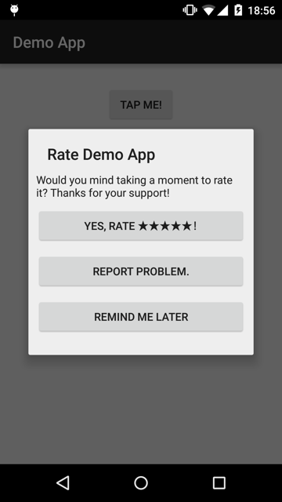

# RMP-AppiraterKit

RMP-AppiraterKit is an Android library to create your customaizable user review dialog. It will help remind users to review your app on the Google play.



## Download

Gradle:

```groovy
compile 'jp.co.recruit_mp:android-RMP-AppiraterKit:1.0'
```

## Usage

```java
public class MainActivity extends ActionBarActivity {

    private static final String PREF_KEY_APP_ALREADY_RATE = "PREF_KEY_APP_ALREADY_RATE";

    @Override
    protected void onCreate(Bundle savedInstanceState) {
        super.onCreate(savedInstanceState);
        setContentView(R.layout.activity_main);

        // Notify app launch to RmpAppiraterKit.
        AppiraterMeasure.appLaunched(this);

        Button button = (Button) findViewById(R.id.tap_me);
        button.setOnClickListener(new View.OnClickListener() {
            @Override
            public void onClick(View v) {
                showDialog();
            }
        });
    }

    private void showDialog() {
        final SharedPreferences prefs = getSharedPreferences("Settings", Context.MODE_PRIVATE);

        // Gets last AppiraterMeasure#appLaunched(android.content.Context) result.
        AppiraterMeasure.Result appiraterResult = AppiraterMeasure.getLastAppLaunchedResult();
        if (
            // Not select "Yes, Rate" button yet. or ...
            !prefs.getBoolean(PREF_KEY_APP_ALREADY_RATE, false) ||
            // Change application version.
            (appiraterResult != null &&
                    appiraterResult.getAppVersionCode() != appiraterResult.getPreviousAppVersionCode())) {
            // Create app review dialog.
            AppiraterDialogBuilder builder = new AppiraterDialogBuilder(this);
            builder
                    .setTitle("Rate Tis app")
                    .setMessage("Would you mid taking a moment to rate it? Thanks for your support!")
                    .addButton("YES, RATE ★★★★★!", new AppiraterDialogBuilder.OnClickListener() {
                        @Override
                        public void onClick(Dialog dialog) {
                            SharedPreferences.Editor prefsEditor = prefs.edit();
                            prefsEditor.putBoolean(PREF_KEY_APP_ALREADY_RATE, true);
                            prefsEditor.apply();

                            AppiraterUtils.launchStrore(MainActivity.this);
                            dialog.dismiss();
                        }
                    })
                    .addButton("REPORT PROBLEM", new AppiraterDialogBuilder.OnClickListener() {
                        @Override
                        public void onClick(Dialog dialog) {
                            Uri uri = Uri.parse("http://www.google.com/"); // Inputs your supports site.
                            Intent intent = new Intent(Intent.ACTION_VIEW, uri);
                            startActivity(intent);
                            dialog.dismiss();
                        }
                    })
                    .addButton("REMIND ME LATER", new AppiraterDialogBuilder.OnClickListener() {
                        @Override
                        public void onClick(Dialog dialog) {
                            dialog.dismiss();
                        }
                    });
            Dialog dialog = builder.create();
            dialog.show();
        } else {
            new AlertDialog.Builder(MainActivity.this)
                    .setMessage(R.string.already_rated)
                    .setPositiveButton(R.string.close, null)
                    .show();
        }
    }
}
```

## License

```
Copyright (C) 2015 Recruit Marketing Partners Co.,Ltd

Licensed under the Apache License, Version 2.0 (the "License");
you may not use this file except in compliance with the License.
You may obtain a copy of the License at

http://www.apache.org/licenses/LICENSE-2.0

Unless required by applicable law or agreed to in writing, software
distributed under the License is distributed on an "AS IS" BASIS,
WITHOUT WARRANTIES OR CONDITIONS OF ANY KIND, either express or implied.
See the License for the specific language governing permissions and
limitations under the License.
```

## Reference

- [appirater](https://github.com/arashpayan/appirater/)
- [appirater-android](https://github.com/drewjw81/appirater-android/)
- [android-RMP-Appirater](https://github.com/recruit-mp/android-RMP-Appirater/)
